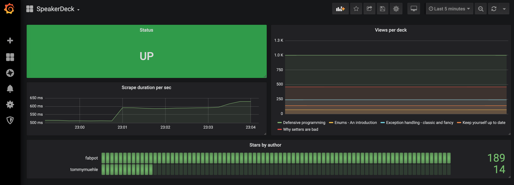

# SpeakerDeck Prometheus Exporter

SpeakerDeck Prometheus exporter makes it possible to monitor stats of various decks by various authors on SpeakerDeck using Prometheus.

## Project status

[](https://travis-ci.org/tommy-muehle/speakerdeck_exporter)
[](https://goreportcard.com/report/github.com/tommy-muehle/speakerdeck_exporter)
[](https://codecov.io/gh/tommy-muehle/speakerdeck_exporter)

## Exported Metrics

* ```speakerdeck_scrape_collector_state```  
  The status of the last metric scrape: 1 for a successful scrape and 0 for a failed one.
* ```speakerdeck_scrape_collector_duration_seconds```  
  Duration of the last metric scrape in seconds.
* ```speakerdeck_stars```  
  The stars of a deck and by an author.
* ```speakerdeck_views```  
  The stars of a deck and by an author.
  
An example set of metrics can be found [here](METRICS.md).

## Prerequisites

I assume that you have already installed Prometheus. Configure Prometheus to scrape metrics from the server with the exporter. 
Note that the default scrape port of the exporter is 9887 and the metrics path -- "/metrics".

## Usage

#### Command-line Arguments

```shell
Usage of ./speakerdeck-exporter:

-addr
    An address to listen on for web interface and telemetry.
-users
    Comma separated list of Speakerdeck users to watch.
-version
    Prints the current version.

```

## Grafana

An example dashboard in Grafana could look like [this](grafana/dashboard.json):


